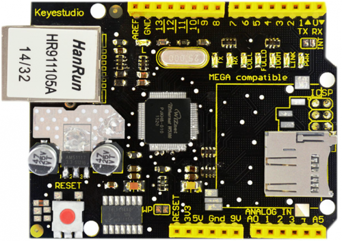
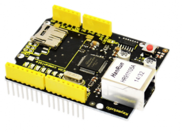
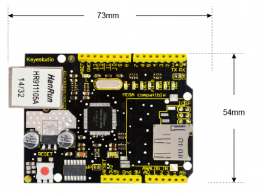
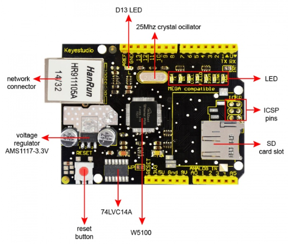
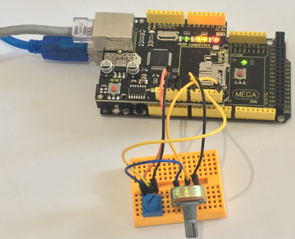
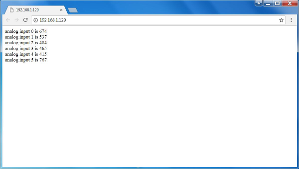
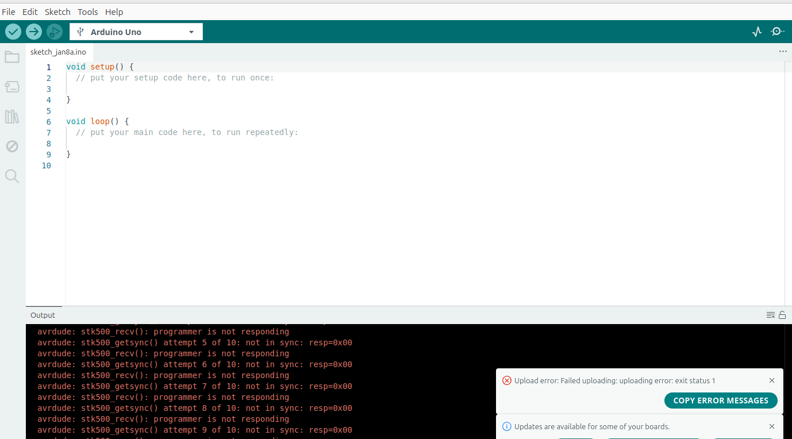

# KS0156 keyestudio W5100 Ethernet Shield



## 1. Introduction

keyestudio W5100 Ethernet Shield gives you an easy way to get your Arduino Online. It can turn your Arduino into a simple web server or use the Internet to read /write its digital and analog outputs/inputs. Compatible with the UNO R3 board and Mega 2560 R3.

It is directly supported by Arduino official Ethernet Library. It also supports the read &write of mini SD card (TF card).

The shield adopts stackable design. You can directly plug it to Arduino board or plug other shields onto this Ethernet shield. 

Note: its MAC address is random. You can set MAC address in the code.

## 2. Features

- Compatible with UNO R3 and MEGA 2560 control board.
- Comes with a SD card slot, supporting the read/write of mini SD card (TF card).
- Comes with a reset button
- Onboard comes with a D13 led
- Comes with a network connector, used to connect the network.
- Comes with several LED indicators for various status, such as network connection, powering on and communication situation.
- Support TCP/IP protocols



## 3. Technical Details

- Dimensions: 73mm x 54mm x 29mm
- Weight: 25.4g



## 4. PINOUT Instruction



**Indicator light functions:**

- **L:** D13 LED ( D13 light up at HIGH, off at LOW)
- **PWR:** power led
- **LINK:** the network is connected. It will flash when send or receive the data
- **100M:** the network connection is in 100M/s
- **FULLD:** the network connection is full duplex communication
- **COLL:** flashing when the network detects a conflict.
- **RX:** flashing when the network receives data.
- **TX:** flashing when the network sends data.

## 5. Test Code

**Library files and code download:**  [Resources](./Resources.7z)

```c
#include <SPI.h>
#include <Ethernet.h>
// Enter a MAC address and IP address for your controller below.
// The IP address will be dependent on your local network:
byte mac[] = {0xDE, 0xAD, 0xBE, 0xEF, 0xFE, 0xED };
IPAddress ip(192,168,0,152);//modifying according your own IP
// Initialize the Ethernet server library
// with the IP address and port you want to use
// (port 80 is default for HTTP):
EthernetServer server(80);

void setup() 
{
  // Open serial communications and wait for port to open:
  Serial.begin(9600);
  while (!Serial) 
  {
    ; // wait for serial port to connect. Needed for Leonardo only
  }
  // start the Ethernet connection and the server:
  Ethernet.begin(mac, ip);
  server.begin();
  Serial.print("server is at ");
  Serial.println(Ethernet.localIP());
}

void loop() 
{
  // listen for incoming clients
  EthernetClient client = server.available();
  if (client) 
  {
    Serial.println("new client");
    // an http request ends with a blank line
    boolean currentLineIsBlank = true;
    while (client.connected()) 
    {
      if (client.available()) 
      {
        char c = client.read();
        Serial.write(c);
        // if you've gotten to the end of the line (received a newline
        // character) and the line is blank, the http request has ended,
        // so you can send a reply
        if (c == '\n' && currentLineIsBlank) 
        {
          // send a standard http response header
          client.println("HTTP/1.1 200 OK");
          client.println("Content-Type: text/html");
          client.println("Connection: close"); // the connection will be closed after completion
          //of the response
          client.println("Refresh: 5"); // refresh the page automatically every 5 sec
          client.println();
          client.println("<!DOCTYPE HTML>");
          client.println("<html>");
          // output the value of each analog input pin
          for (int analogChannel = 0; analogChannel < 6; analogChannel++) 
          {
            int sensorReading = analogRead(analogChannel);
            client.print("analog input ");
            client.print(analogChannel);
            client.print(" is ");
            client.print(sensorReading);
            client.println("<br />");
          }
          client.println("</html>");
          break;
        }
        if (c == '\n') 
        {
          // you're starting a new line
          currentLineIsBlank = true;
        }
        else if (c != '\r') 
        {
          // you've gotten a character on the current line
          currentLineIsBlank = false;
        }
      }
    }
    // give the web browser time to receive the data
    delay(1);
    // close the connection:
    client.stop();
    Serial.println("client disonnected");
  }
}
```

**Code to Note:**

1. In the code, you can set the MAC, **byte mac[] = { 0xDE, 0xAD, 0xBE, 0xEF, 0xFE, 0xED }**, the content value can be set by yourself. It is hexadecimal.
2. Set the IP address **ip(192,168,1,129)** in the code. It is the IP address that connected to the network connector on the shield.

## 6. Example Result

Stack the shield onto the MEGA2560 board, then upload the code to MEGA 2560 and connect the network, open the Google browser and enter the IP address, it will display the analog data of A0-A5. Shown below.





## FQA

During the code upload process, if the error shown in the image occurs, please press the reset button immediately after the code has been compiled. The code should then upload successfully (if it fails, please try several times).


